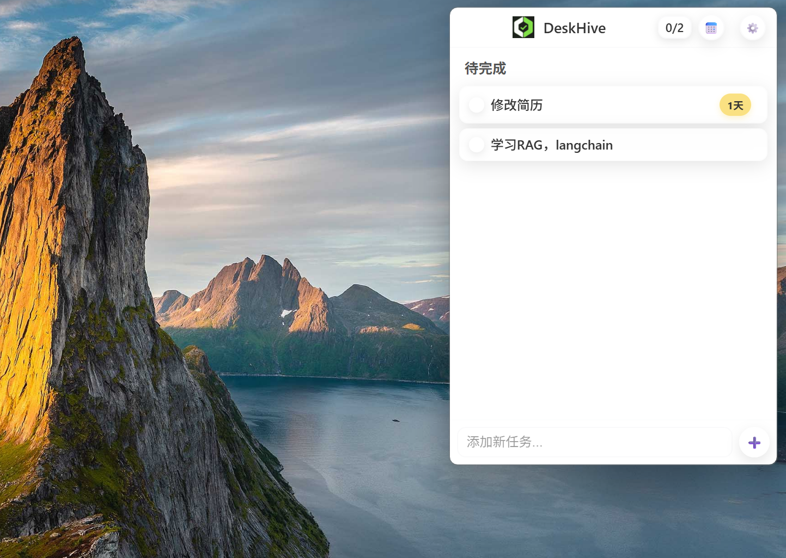

# DeskHive 🐝

<div align="center">



**一个轻量级、高效的桌面待办事项管理工具**

[](https://github.com/yourusername/DeskHive)
[](LICENSE)
[](https://tauri.app/)
[](https://vuejs.org/)

[中文](#中文) | [English](#english)

</div>

---

## 中文

### 📖 简介

DeskHive 是一个基于 **Vue 3** 和 **Tauri** 构建的现代化桌面待办事项管理工具。它专注于提供简洁、高效的任务管理体验，所有数据本地存储，无需云端服务，保护您的隐私。

### ✨ 核心特性

#### 🎯 任务管理
- ✅ 快速创建、编辑、删除任务
- ✅ 双击快速删除，右键菜单丰富操作
- ✅ 任务完成状态切换，带动画效果
- ✅ 支持任务拖拽排序（分组内/跨分组）
- ✅ 已完成任务独立分组管理

#### 📁 分组功能
- 📂 快速创建分组：输入 `/分组名` 即可
- 📂 对话框创建：右键"+"按钮选择新建分组
- 📂 分组重命名、删除、折叠/展开
- 📂 分组顺序调整（上移/下移）
- 📂 跨分组拖拽任务

#### ⏰ 时间管理
- 🕐 设置任务截止时间
- 🕐 实时倒计时显示
- 🕐 智能时间指示器：
  - 🟢 绿色：距离截止时间充足
  - 🔴 红色：已超过截止时间
  - 🟡 黄色：任务创建天数提醒
- 🕐 悬停显示详细时间信息

#### 🎨 界面设计
- 🌈 现代化、简洁的 UI 设计
- 🌈 响应式布局，自适应窗口大小
- 🌈 日间/夜间主题切换
- 🌈 窗口透明度自定义
- 🌈 流畅的动画效果

#### 🔧 系统集成
- 💻 系统托盘集成
- 💻 开机自启动选项
- 💻 全局快捷键支持
- 💻 窗口位置记忆
- 💻 禁用拖动窗口选项

### 🚀 快速开始

#### 下载安装

1. 前往 [Releases](https://github.com/yourusername/DeskHive/releases) 页面
2. 下载最新版本的安装包（`.msi` 文件）
3. 双击安装包，按照提示完成安装
4. 启动 DeskHive，开始管理您的任务！

#### 系统要求

- **操作系统**: Windows 10/11 (64位)
- **内存**: 最低 8MB
- **磁盘空间**: 约 50MB

### 📚 使用指南

#### 任务管理

| 操作 | 方法 |
|------|------|
| **创建任务** | 底部输入框输入内容，按回车或点击"+" |
| **快速创建分组** | 输入 `/分组名` 按回车 |
| **完成任务** | 悬停任务，点击"✓"按钮 |
| **取消完成** | 在已完成分组中点击"↶"按钮 |
| **删除任务** | 双击任务项 |
| **编辑任务** | 右键任务 → "✏️ 编辑任务" |
| **拖动排序** | 点住"☰"按钮拖动 |

#### 分组管理

| 操作 | 方法 |
|------|------|
| **快速创建** | 输入 `/分组名` 按回车 |
| **对话框创建** | 右键"+"按钮 → "📁 新建分组" |
| **重命名** | 右键分组标题 → "✏️ 重命名分组" |
| **删除** | 右键分组标题 → "🗑️ 删除分组" |
| **折叠/展开** | 点击分组标题左侧"▼"图标 |
| **调整顺序** | 悬停分组标题，点击"▲▼"按钮 |

#### 时间管理

| 操作 | 方法 |
|------|------|
| **设置截止时间** | 右键任务 → "📅 设置截止时间" |
| **移除截止时间** | 右键任务 → "🗑️ 移除截止时间" |
| **查看时间详情** | 悬停时间指示器 |

#### 拖动功能

- **分组内拖动**: 点住"☰"按钮，在同一分组内上下拖动
- **跨分组拖动**: 
  - 拖到目标分组任务列表 → 插入指定位置
  - 拖到目标分组标题 → 添加到末尾
- **拖动提示**: 目标区域显示蓝色高亮

#### 系统托盘

- **左键点击**: 显示/隐藏主窗口
- **右键菜单**: 
  - 显示/隐藏
  - 设置
  - 退出

### 🛠️ 开发指南

#### 技术栈

- **前端框架**: Vue 3.5 + TypeScript
- **构建工具**: Vite 6.4
- **桌面框架**: Tauri 2.0
- **后端语言**: Rust
- **UI 设计**: 自定义 CSS（响应式）
- **数据存储**: 本地 JSON 文件

#### 环境要求

- Node.js >= 20.19.0 或 >= 22.12.0
- Rust 工具链（rustup, cargo）
- npm 或 pnpm

#### 本地开发

```bash
# 克隆仓库
git clone https://github.com/yourusername/DeskHive.git
cd DeskHive

# 安装依赖
npm install

# 启动开发服务器
npm run dev

# 构建生产版本
npm run tauri build
```

#### 项目结构

```
DeskHive/
├── src/                      # Vue 前端源码
│   ├── components/          # Vue 组件
│   ├── App.vue             # 主应用组件
│   ├── Settings.vue        # 设置页面组件
│   ├── types.ts            # TypeScript 类型定义
│   └── main.ts             # 前端入口
├── src-tauri/               # Tauri 后端源码
│   ├── src/                # Rust 源码
│   │   ├── data/          # 数据管理模块
│   │   ├── window/        # 窗口管理模块
│   │   ├── system/        # 系统集成模块
│   │   └── lib.rs         # 主入口
│   ├── Cargo.toml         # Rust 依赖配置
│   └── tauri.conf.json    # Tauri 配置
├── public/                  # 静态资源
└── package.json            # Node.js 依赖配置
```

### 📝 更新日志

#### v0.3.0 (2025-11-27)

**✨ 新增功能**
- 快速创建分组：输入 `/分组名` 直接创建
- 优化时间指示器位置：移到任务条最右侧
- 截止时间弹窗缩小：更符合整体风格
- 改进"全部完成"页面显示逻辑

**🐛 问题修复**
- 修复输入 `/分组名` 还会弹窗的问题
- 修复任务列表显示过宽的问题
- 改进应用退出逻辑，减少安装时卡住的可能性
- 修复空分组提示框占据空间的问题

**📝 文档更新**
- 更新设置页面的使用说明
- 完善 README 文档

#### v0.2.0 (2025-11-22)

**✨ 新增功能**
- 任务拖动排序：支持分组内和跨分组拖动
- 分组排序：可通过上下箭头调整分组顺序
- 时间提示：悬停时间指示器显示详细信息
- 完成动画：优化任务完成时的视觉效果

**🎨 界面优化**
- 重新设计时间指示器样式和颜色
- 优化已完成分组的高度和间距
- 改进任务完成状态的视觉反馈
- 添加自定义 Tooltip 组件

**🐛 问题修复**
- 修复跨组拖动任务的问题
- 修复提示框被分组遮挡的问题
- 移除按截止时间自动排序的逻辑

### 🤝 贡献指南

欢迎提交 Issue 和 Pull Request！

1. Fork 本仓库
2. 创建您的特性分支 (`git checkout -b feature/AmazingFeature`)
3. 提交您的更改 (`git commit -m 'Add some AmazingFeature'`)
4. 推送到分支 (`git push origin feature/AmazingFeature`)
5. 开启一个 Pull Request

### 📧 联系方式

- **作者**: iamlzy
- **博客**: [https://www.feijimiao.cn](https://www.feijimiao.cn/contact)
- **微信公众号**: 扫描下方二维码关注

<div align="center">
  
</div>

### 📄 许可证

本项目采用 MIT 许可证 - 查看 [LICENSE](LICENSE) 文件了解详情

### 🙏 致谢

- [Tauri](https://tauri.app/) - 强大的桌面应用框架
- [Vue.js](https://vuejs.org/) - 渐进式 JavaScript 框架
- [Vite](https://vitejs.dev/) - 下一代前端构建工具

---

## English

### 📖 Introduction

DeskHive is a modern desktop to-do management tool built with **Vue 3** and **Tauri**. It focuses on providing a clean and efficient task management experience with all data stored locally, no cloud services required, protecting your privacy.

### ✨ Key Features

#### 🎯 Task Management
- ✅ Quick create, edit, and delete tasks
- ✅ Double-click for quick deletion, rich context menu
- ✅ Task completion status toggle with animations
- ✅ Drag and drop task reordering (within/across groups)
- ✅ Completed tasks in separate group

#### 📁 Group Management
- 📂 Quick create: Type `/group-name` and press Enter
- 📂 Dialog create: Right-click "+" button
- 📂 Rename, delete, collapse/expand groups
- 📂 Adjust group order (move up/down)
- 📂 Drag tasks between groups

#### ⏰ Time Management
- 🕐 Set task deadlines
- 🕐 Real-time countdown display
- 🕐 Smart time indicators:
  - 🟢 Green: Sufficient time until deadline
  - 🔴 Red: Past deadline
  - 🟡 Yellow: Days since task creation
- 🕐 Hover for detailed time information

#### 🎨 Interface Design
- 🌈 Modern, clean UI design
- 🌈 Responsive layout, adaptive window size
- 🌈 Day/Night theme switching
- 🌈 Customizable window transparency
- 🌈 Smooth animations

#### 🔧 System Integration
- 💻 System tray integration
- 💻 Auto-start on boot option
- 💻 Global hotkey support
- 💻 Window position memory
- 💻 Disable window dragging option

### 🚀 Quick Start

#### Download & Install

1. Go to [Releases](https://github.com/yourusername/DeskHive/releases) page
2. Download the latest version installer (`.msi` file)
3. Double-click the installer and follow the prompts
4. Launch DeskHive and start managing your tasks!

#### System Requirements

- **OS**: Windows 10/11 (64-bit)
- **RAM**: Minimum 10MB
- **Disk Space**: ~50MB

### 📚 User Guide

#### Task Management

| Action | Method |
|--------|--------|
| **Create Task** | Enter content in bottom input, press Enter or click "+" |
| **Quick Create Group** | Type `/group-name` and press Enter |
| **Complete Task** | Hover over task, click "✓" button |
| **Uncomplete Task** | Click "↶" button in completed group |
| **Delete Task** | Double-click task item |
| **Edit Task** | Right-click task → "✏️ Edit Task" |
| **Drag to Reorder** | Hold "☰" button and drag |

#### Group Management

| Action | Method |
|--------|--------|
| **Quick Create** | Type `/group-name` and press Enter |
| **Dialog Create** | Right-click "+" button → "📁 New Group" |
| **Rename** | Right-click group header → "✏️ Rename Group" |
| **Delete** | Right-click group header → "🗑️ Delete Group" |
| **Collapse/Expand** | Click "▼" icon on left of group header |
| **Adjust Order** | Hover group header, click "▲▼" buttons |

#### Time Management

| Action | Method |
|--------|--------|
| **Set Deadline** | Right-click task → "📅 Set Deadline" |
| **Remove Deadline** | Right-click task → "🗑️ Remove Deadline" |
| **View Details** | Hover over time indicator |

#### Drag & Drop

- **Within Group**: Hold "☰" button, drag up/down within same group
- **Between Groups**: 
  - Drag to target group's task list → Insert at position
  - Drag to target group's header → Add to end
- **Visual Feedback**: Target area shows blue highlight

#### System Tray

- **Left Click**: Show/Hide main window
- **Right Click Menu**: 
  - Show/Hide
  - Settings
  - Quit

### 🛠️ Development Guide

#### Tech Stack

- **Frontend**: Vue 3.5 + TypeScript
- **Build Tool**: Vite 6.4
- **Desktop Framework**: Tauri 2.0
- **Backend**: Rust
- **UI Design**: Custom CSS (Responsive)
- **Data Storage**: Local JSON files

#### Prerequisites

- Node.js >= 20.19.0 or >= 22.12.0
- Rust toolchain (rustup, cargo)
- npm or pnpm

#### Local Development

```bash
# Clone repository
git clone https://github.com/yourusername/DeskHive.git
cd DeskHive

# Install dependencies
npm install

# Start development server
npm run dev

# Build for production
npm run tauri build
```

#### Project Structure

```
DeskHive/
├── src/                      # Vue frontend source
│   ├── components/          # Vue components
│   ├── App.vue             # Main app component
│   ├── Settings.vue        # Settings page component
│   ├── types.ts            # TypeScript type definitions
│   └── main.ts             # Frontend entry
├── src-tauri/               # Tauri backend source
│   ├── src/                # Rust source
│   │   ├── data/          # Data management module
│   │   ├── window/        # Window management module
│   │   ├── system/        # System integration module
│   │   └── lib.rs         # Main entry
│   ├── Cargo.toml         # Rust dependencies
│   └── tauri.conf.json    # Tauri configuration
├── public/                  # Static assets
└── package.json            # Node.js dependencies
```

### 📝 Changelog

#### v0.3.0 (2025-11-27)

**✨ New Features**
- Quick group creation: Type `/group-name` to create directly
- Optimized time indicator position: Moved to rightmost of task bar
- Smaller deadline dialog: Better matches overall style
- Improved "All Completed" page display logic

**🐛 Bug Fixes**
- Fixed issue where typing `/group-name` still showed dialog
- Fixed task list display too wide issue
- Improved app exit logic to reduce installation hang
- Fixed empty group hint taking up space

**📝 Documentation**
- Updated settings page usage instructions
- Enhanced README documentation

#### v0.2.0 (2025-11-22)

**✨ New Features**
- Task drag and drop: Support within and across groups
- Group sorting: Adjust order with up/down arrows
- Time tooltips: Hover time indicator for details
- Completion animation: Optimized visual feedback

**🎨 UI Improvements**
- Redesigned time indicator style and colors
- Optimized completed group height and spacing
- Improved task completion status visual feedback
- Added custom Tooltip component

**🐛 Bug Fixes**
- Fixed cross-group task dragging issues
- Fixed tooltip being covered by groups
- Removed auto-sort by deadline logic

### 🤝 Contributing

Issues and Pull Requests are welcome!

1. Fork this repository
2. Create your feature branch (`git checkout -b feature/AmazingFeature`)
3. Commit your changes (`git commit -m 'Add some AmazingFeature'`)
4. Push to the branch (`git push origin feature/AmazingFeature`)
5. Open a Pull Request

### 📧 Contact

- **Author**: iamlzy
- **Blog**: [https://www.feijimiao.cn](https://www.feijimiao.cn/contact)
- **WeChat Official Account**: Scan QR code below

<div align="center">
  
</div>

### 📄 License

This project is licensed under the MIT License - see the [LICENSE](LICENSE) file for details

### 🙏 Acknowledgments

- [Tauri](https://tauri.app/) - Powerful desktop application framework
- [Vue.js](https://vuejs.org/) - Progressive JavaScript framework
- [Vite](https://vitejs.dev/) - Next generation frontend tooling

---

<div align="center">
  Made with ❤️ by iamlzy
</div>
